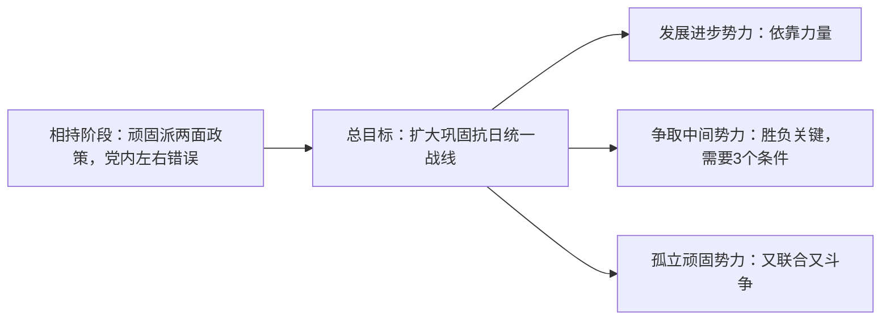

### 1. 反对本本主义（教条主义）

- 反对照搬书本、照搬上级命令的教条主义，坚持一切从实际出发。
- 调查就是解决问题。
- 没有调查就没用发言权
---

### 2. 中国革命战争的战略问题

- 从战争中学习战争

#### 战略防御 （敌强我弱，战略上首先要取防御态势）

1. 积极防御 vs 消极防御 (守中有攻、创造战机，是真防御)
2. 反 “围剿” 准备（早准备，降低损失，有备无患）
3. 战略退却（诱敌深入，必要可以丢弃局部利益保全大局）
4. 战略反攻
5. 反攻开始（初战 / 序战）三原则
   1. 必须打胜：无把握不打，持重待机。
   2. 必须服从全战役计划：初战是序幕，服务全局。
   3. 必须关照下一战略阶段：算长远，不短视。
6. 集中兵力（集中主力于主要方向，辅以游击战争与钳制兵力）
7. 运动战（随机应变，打得赢就打，打不赢就走）
8. 速决战（战略持久战，战役战斗速决战）
9. 歼灭战（以歼灭敌有生力量打破 “围剿”、补充自己、以战养战）

---

### 3. 实践论

核心主题：实践决定认识，认识指导实践，==实践是检验真理的唯一标准==

#### 第一部分：实践是认识的基础

1. 实践是最基本的活动
2. 实践是认识的唯一来源
3. 实践是认识发展的动力
4. 实践是检验真理的唯一标准
5. 实践是认识的目的

#### 第二部分：认识发展的两个阶段

1. 感性认识（低级阶段）
2. 理性认识（高级阶段）
3. 实践是认识发展的动力

#### 第三部分：认识的能动飞跃

1. 第一次飞跃：实践 → 感性 → 理性
2. 第二次飞跃（更重要）：理性 → 回到实践
   - 检验真理
   - 发展真理
   - 改造世界
3. 理论的重要性：没有革命的理论，就没有革命的运动，但理论必须付诸实践。

#### 第四部分：认识运动的反复性与无限性

1. 对一个具体事物
   实践 — 认识 — 实践，往往要多次反复才能成功，因受主客观条件限制。
2. 对整个世界
   客观世界永远发展，人的认识也永无止境。
3. 绝对真理与相对真理
   - 无数相对真理总和构成绝对真理
   - 马克思主义不结束真理，而是在实践中不断开辟认识真理的道路

#### 第五部分：反对错误思想

1. 右倾机会主义（顽固派）
   思想落后于实际，跟不上时代，开倒车。
2. “左” 倾空谈主义（冒险主义）
   思想超过客观阶段，把幻想当真理，盲目冒进。
3. 共同错误
   主观与客观分裂，认识与实践脱离。

---

### 4. 矛盾论

#### 第一部分：两种宇宙观

##### 形而上学宇宙观

1. 基本特点
   用孤立、静止、片面的观点看世界。
2. 主要观点
   认为事物彼此孤立、永远不变
   变化只是数量增减、场所变更，没有质变
   发展原因在外部（外力推动），否认内部矛盾
   认为事物永远只能重复自己，不能变成新事物

##### 唯物辩证法宇宙观

1. 基本特点
   用联系、发展、全面、矛盾的观点看世界。
2. 主要观点
   事物发展的根本原因在内部（内部矛盾性）
   外部原因是第二位原因
   事物是自己运动，又和周围事物互相联系、互相影响

#### 第二部分：矛盾的普遍性

矛盾的普遍性（绝对性）有两层意思：

- 矛盾存在于一切事物的发展过程中—— 事事有矛盾
- 每一事物发展过程自始至终都有矛盾运动—— 时时有矛盾

#### 第三部分：矛盾的特殊性

1. 核心定义
   矛盾的特殊性，指不同事物、不同过程、不同阶段、不同方面的矛盾各有其特点，是事物千差万别的内在根据。
2. 为什么要研究特殊性
   1. 是认识事物的基础，只有把握特殊性才能区别事物。
   2. 是科学分类的依据，不同科学对应不同特殊矛盾。
   3. 是马克思主义活的灵魂：具体问题具体分析。
   4. 批判教条主义：拒绝研究具体情况，生搬硬套公式。
3. 研究特殊性必须反对三种错误
   - 主观性：不从客观实际出发，凭想象。
   - 片面性：只看一方、不看双方，只看局部不看全体（知彼知己）。
   - 表面性：不深入本质，粗枝大叶、远观而不细察。
4. 认识规律：由特殊到一般，再由一般到特殊
   - 先认识许多特殊事物 → 概括出共同本质（普遍）。
   - 再用普遍指导新的具体事物 → 深化、丰富普遍。
   - 教条主义颠倒、割裂这两个过程。
5. 根本矛盾与阶段性矛盾
   - 根本矛盾：决定过程本质，贯穿始终，过程完结才消灭。
   - 阶段矛盾：根本矛盾在各阶段表现不同，有的激化、有的缓和、有的发生。
   - 不研究阶段特点，就不能正确处理矛盾。

#### 第四部分：矛盾的特殊性

1. 核心总纲
   在复杂事物的发展过程中，存在许多矛盾，其中必有一种是主要矛盾；任何矛盾的双方，必存在主要方面。研究矛盾，必须抓住不平衡性。
2. 主要矛盾

   - 定义
     在复杂事物中，起领导、决定作用，规定和影响其他矛盾存在与发展的矛盾。
   - 作用
     捉住主要矛盾，一切问题就迎刃而解。
   - 地位不是固定的
     随着条件变化，主要矛盾与次要矛盾会互相转化。
   - 中国的典型例子

   1. 帝国主义侵略战争时期：民族矛盾（中国与帝国主义）上升为主要矛盾，国内阶级矛盾降为次要。
   2. 和平压迫时期：人民大众 vs 帝国主义 + 封建势力成为主要矛盾。
3. 矛盾双方转化的根本原因
   由矛盾双方斗争力量的增减程度决定。斗争 → 力量消长 → 主次换位 → 事物性质改变。
4. **意义**：

   1. 必须反对均衡论，世界==没有绝对平衡==。
   2. ==研究主次矛盾、主次方面的不平衡==，是制定战略战术、政治方针的根本方法。
   3. 不抓主次，就会如堕烟海，找不到中心，无法解决矛盾。

#### 第五部分：矛盾诸方面的同一性和斗争性

##### 同一性

1. 含义
   - 互为存在前提
     矛盾双方互相依赖，一方以对方为存在条件，共处于一个统一体中。
   - 在一定条件下互相转化
     矛盾双方各向着相反的方面、对立的地位转化。
2. 特点
   - 是有条件的：必须具备一定条件才能统一、转化。
   - 是暂时的、相对的：不是永恒不变的。
   - 是现实具体的：不是神话幻想的变化。

##### 斗争性

- 矛盾双方互相排斥、互相对立、互相斗争的性质。
- 贯穿过程始终，推动事物运动变化

##### 同一性与斗争性的关系

1. 同一性是相对的（有条件、暂时）
2. 斗争性是绝对的（无条件、贯穿始终）
3. 二者结合：有条件的相对同一性 + 无条件的绝对斗争性 = 一切事物的矛盾运动。
4. 斗争性寓于同一性之中：没有斗争性就没有同一性。
5. 相反相成：对立（斗争）又统一（同一）。

##### 事物运动的两种状态

1. 相对静止：量变，矛盾斗争未激化。
2. 显著变动：质变，统一体分解，矛盾解决。
   两种状态都由内部斗争引起。

#### 第六部分：对抗在矛盾中的地位

1. 核心定义
   对抗是矛盾斗争的一种形式，不是一切形式。
2. 什么是对抗
   矛盾发展到一定阶段，由内部斗争转为外部冲突的形式。
3. 对抗的重要意义
   在阶级社会中，革命与革命战争不可避免。
   这是完成社会飞跃、推翻反动统治、人民夺取政权的必经之路。
4. 矛盾可分为两类
   - 对抗性矛盾：外部冲突、暴力解决（如敌对阶级）
   - 非对抗性矛盾：不爆发外部冲突、和平解决（如人民内部、党内思想）
5. 不同性质的矛盾，用不同的斗争形式、不同方法解决。反对把对抗绝对化、公式化。

---

### 5. 反对自由主义

#### 开篇立论：思想斗争的重要性与自由主义的危害

- 积极的思想斗争是达到党内和革命团体团结、利于战斗的核心武器，共产党员与革命分子必须拿起这一武器。
- 自由主义取消思想斗争，追求无原则和平，导致腐朽庸俗作风，使组织与个人政治腐化。

#### 自由主义的十一种具体表现

1. 熟人无原则：因熟人、同乡、亲友等关系，明知错误不做原则争论，轻描淡写、一团和气。
2. 背后乱批评：不负责任背后议论，当面不说、背后乱说，开会不说、会后乱说，无视集体原则。
3. 明哲保身：事不关己、高高挂起，明知不对少说为佳，只求无过。
4. 无视纪律：不服从命令，个人意见至上，只要组织照顾、不要组织纪律。
5. 泄愤报复：非为团结进步，而是搞个人攻击、闹意气、泄私愤、图报复。
6. 是非不分：听任错误言论不争辩，对反革命言论不报告，泰然处之。
7. 脱离群众：不宣传、不关心群众，漠视群众疾苦，将党员混同普通百姓。
8. 损害群众利益：对侵害群众利益行为不愤恨、不制止，听之任之。
9. 敷衍工作：办事无计划方向，敷衍了事、得过且过，缺乏责任心。
10. 摆老资格：自恃有功，大事做不来、小事不愿做，工作松懈、学习松弛。
11. 知错不改：明知自身错误，却不愿纠正，自我放任

#### 自由主义的严重危害

- 腐蚀剂作用：涣散团结、松懈关系、消极工作、制造分歧。
- 组织破坏：瓦解队伍纪律，导致政策无法贯彻，党与群众隔离。
- 性质定性：革命队伍中严重恶劣倾向，必须坚决清除

---

### 6. 抗日游击战争的战略问题

#### 第一章 为什么提起游击战争的战略问题

1. 基本定位
   - 正规战争为主，游击战争为辅，但游击战争必须提升到战略地位。
2. 战略地位的根本原因
   - 中国是大而弱，被小而强的日本攻击。
   - 敌人占地广、兵力不足，形成大量后方空虚区。
   - 游击战争是大规模、外线单独作战，不是小规模战术配合。
   - 战争长期且残酷，需要根据地、战略防御进攻、向运动战发展。
3. 特殊性
   - 抗日游击战争有自身特殊规律，不能照搬正规战争战略。

> 我们的敌人大概还在那里做元朝灭宋、清朝灭明、英占北美和印度、拉丁系国家占中南美等等的好梦。这等梦在今天的中国已经没有现实的价值，因为今天的中国比之上述历史多了一些东西，颇为新鲜的游击战争就是其中的一点。假如我们的敌人少估计了这一点，他们就一定要在这一点上面触一个很大的霉头。

#### 第二章 为战争的基本原则：保存自己，消灭敌人

1. 核心原则
   - 一切军事行动的根本准则：保存自己，消灭敌人。
2. 与牺牲的关系
   - 局部、暂时的牺牲是为了全体、永久的保存，二者相反相成。
3. 政治目的
   - 驱逐日本帝国主义，建立独立自由幸福的新中国。

#### 第三章 抗日游击战争的六个具体战略问题（总纲）

1. 主动、灵活、有计划地执行：防御中的进攻，持久中的速决，内线中的外线
2. 与正规战争相配合
3. 建立根据地
4. 战略防御与战略进攻
5. 向运动战发展
6. 正确的指挥关系

#### 第四章 第一个战略问题：防御中的进攻、持久中的速决、内线中的外线

1. 基本方针
   - 战略上：内线、防御、持久
   - 战役战斗上：外线、进攻、速决
2. 作战要求
   - 集中兵力、秘密神速、出其不意、奇袭为主。
   - 力戒消极防御、拖延、临战分散。
3. ==主动性==
   - 利用敌人兵力不足、异国作战、指挥笨拙三大弱点争取主动。
   - 被动时靠 “走” 与 “再坚持一下” 恢复主动。
4. ==灵活性==
   - 灵活使用兵力三法：分散（化整为零）、集中（化零为整）、转移。
5. ==计划性==
   - 依据敌情、任务、地形、民众条件做周密计划。
6. 核心
   - 进攻是中心，一切围绕进攻展开。

#### 第五章 第二个战略问题：和正规战争相配合

1. 三种配合层次
   - 战略配合：敌后削弱、钳制、破坏敌人运输线。
   - 战役配合：配合正面战场作战，断敌后路、扰敌供给。
   - 战斗配合：战场钳制、侦察、向导、阻援。
2. 要求：统一协调，反对 “不游不击、游而不击”。

#### 第六章 第三个战略问题：建立根据地

- 战争长期残酷，无根据地则游击战争不能长期生存。
- 反对流寇主义。

#### 第七章 第四个战略问题：战略防御与战略进攻

1. 战略防御（敌攻我守）
   - 敌多路围攻时：反围攻，钳制多路、歼敌一路。
   - 方法：袭击、伏击、围点打援、坚壁清野、发动民众。
   - 原则：内线主力歼敌，外线袭扰援兵（围魏救赵）。
2. 战略进攻（敌守我攻）
   - 消灭小敌、拔除据点、发动民众、扩大区域、训练部队。
   - 乘胜发展，但不忘巩固，警惕敌人反扑。

#### 第八章 第五个战略问题：向运动战发展

- 必要性
  - 长期战争要求游击队升级为正规部队，游击战向运动战发展。
- 条件
  - 数量扩大：集中小部队、动员民众。
  - 质量提高：政治、组织、装备、战术、纪律全面正规化。

#### 第九章 第六个战略问题：正确的指挥关系

- 战略集中指挥，战役战斗分散指挥。
- 统称之为：战略统一下的独立自主的游击战争。

---

### 7. 论持久战（1938年在延安抗日战争研究会讲演）

> ==写作背景==：1938年，抗日战争进入第十个月，徐州失守、武汉告急，国内“亡国论”与“速胜论”两种错误思潮蔓延。毛泽东决定系统总结抗战经验，批驳错误论调，指明抗战前途与策略，以持久战思想武装全党全民族。文章于1938年5月经过约九天九夜的写作完成初稿，随后在延安抗日战争研究会上发表长篇演讲。

#### 方法论价值

《论持久战》的论证方法：

> **从矛盾分析出发，把握全局，预见趋势，制定策略。**

这一方法超越了具体的战争场景，成为一种具有普遍意义的方法论。

它告诉我们：

- 面对复杂局面，不能只看一方面的因素；
- 不能只看眼前的强弱对比；
- 而要从全部因素出发；
- 看到变化和发展的趋势；
- 在动态中寻找制胜之道。

#### 问题的提起

1. 提出问题的紧迫性
   抗战一周年将至，战争过程究竟怎样、能否胜利、能否速胜，这些问题大多数人尚未解决。亡国论者说中国会亡，速胜论者说很快就能战胜，这些议论都是不对的，但尚未为大多数人所了解。抗战十个月的经验，已足以击破亡国论，也足以说服速胜论。
2. 两种错误观点的本质
   - **亡国论**：产生妥协倾向。抗战前即有“中国武器不如人，战必败”等论调；抗战后公开的亡国论消失，但暗地里的妥协空气时起时伏，主张妥协者的根据是“再战必亡”。这类亡国论者是妥协倾向的社会基础。
   - **速胜论**：产生轻敌倾向。抗战初起时，许多人有一种毫无根据的乐观倾向，把日本估计过低；有些人轻视游击战争的战略地位。
   - 二者共同的认识论根源：看问题的方法是**主观的和片面的**，一句话，非科学的。
3. 问题的实质
   “卢沟桥事变以来，四万万人一齐努力，最后胜利是中国的”这个公式是对的:
   - 为什么是持久战？
   - 怎样进行持久战？
   - 为什么会有最后胜利？
   - 怎样争取最后胜利？

#### 问题的根据

**核心命题**：
中日战争不是任何别的战争，乃是**半殖民地半封建的中国**和**帝国主义的日本**之间在二十世纪三十年代进行的一个**决死的战争**。全部问题的根据就在这里。

（一）日本方面的四个特点（一优三劣）

| 特点                 | 内容                                                     | 战略含义                             |
| -------------------- | -------------------------------------------------------- | ------------------------------------ |
| 第一，军事力强       | 军力、经济力和政治组织力在东方是一等的                   | 决定了战争的不可避免和中国的不能速胜 |
| 第二，退步性、野蛮性 | 战争的帝国主义性，战争是退步的和野蛮的                   | 这是日本战争必然失败的主要根据       |
| 第三，人力物力不足   | 国度小，人力、军力、财力、物力均感缺乏，经不起长期战争   | 战争将连它原有的东西也消耗掉         |
| 第四，国际寡助       | 虽得到法西斯国家援助，但遇到超过其援助力量的国际反对力量 | “失道寡助”的规律                   |

**总括**：
日本的长处是其战争力量之强，而其短处则在其战争本质的退步性、野蛮性，在其人力、物力之不足，在其国际形势之寡助。

（二）中国方面的四个特点（一劣三优）

| 特点           | 内容                                                                                                         | 战略含义                         |
| -------------- | ------------------------------------------------------------------------------------------------------------ | -------------------------------- |
| 第一，军事力弱 | 半殖民地半封建国家，军力、经济力和政治组织力不如敌人                                                         | 决定了战争的不可避免和不能速胜   |
| 第二，进步性   | 有了资本主义、无产阶级和资产阶级，有了共产党和共产党领导的军队，有了数十年革命传统经验，特别是十七年来的经验 | 这是持久战和最后胜利可能性的基础 |
| 第三，正义性   | 战争是进步的、正义的，能唤起全国团结，激起敌国人民同情，争取世界多数国家援助                                 | 得道多助                         |
| 第四，大国条件 | 地大、物博、人多、兵多                                                                                       | 能够支持长期战争                 |

（三）对比的总体结论

强弱对比规定了日本能够在中国有一定时期和一定程度的横行，==中国不可避免地要走一段艰难的路程==，抗日战争是**持久战而不是速决战**；然而小国、退步、寡助和大国、进步、多助的对比，又规定了日本不能横行到底，必然要遭到最后的失败，中国决不会亡，必然要取得最后的胜利。

#### 驳亡国论

**核心论点**：
亡国论者搬出中国近代解放运动的失败史来证明“抗战必亡”“再战必亡”，但我们的答复是**时代不同**。

- **日本方面**：日本比过去更强了，但这是暂时的。在长期战争过程中，其人力物力不足的因素、战争退步性和野蛮性加剧本国阶级对立的因素，必然要发生相反的变化。
- **中国方面**：不但现在已有新的人、新的政党、新的军队和新的抗日政策，而且这些必然会向前发展。伟大的抗日民族统一战线，就是这种努力的总方向。
- **国际方面**：国际局面根本已和过去两样，大量和直接的援助正在酝酿中。苏联的存在，鼓舞了中国的抗战。
- **方法论批判**：亡国论者主观地、片面地只承认亡国一个可能性，否认解放的可能性，更不会指出解放的条件和为争取这些条件而努力。我们则客观地、全面地承认亡国和解放两个可能同时存在，着重指出**解放的可能占优势**。

#### 妥协还是抗战？腐败还是进步

**问题的提出**：

有许多爱国志士对时局怀抱忧虑，问题有两个：一是害怕对日妥协，二是怀疑政治不能进步。

（一）妥协是不会成功的——从三方面找根据

- **日本方面**：敌人的掠夺政策是灭亡中国的政策，分为物质的和精神的两方面，普遍地施之于中国人。在物质上掠夺衣食、生产工具，在精神上摧残民族意识。这就激怒了一切阶层的中国人，形成了绝对的敌对。日本战争的坚决性和特殊的野蛮性，规定了“降不了”的一方面。
- **中国方面**：坚持抗战的因素有三个：
  1. 共产党是领导人民抗日的可靠力量；
  2. 国民党依靠英美，英美不叫它投降；
  3. 别的党派大多数反对妥协、拥护抗战。
     三者互相团结，谁要妥协就是站在汉奸方面，人人得而诛之。
- **国际方面**：除日本的盟友和某些资本主义国家上层分子外，其余都不利于中国妥协而利于中国抗战。空前强大的社会主义苏联和中国是历来休戚相关的。

（二）腐败现象是可以转变的

承认中国存在腐败现象，但同时也看到进步因素，并指出后者对于前者将逐步地占优势。我们并不悲观，而悲观的人们则与此相反。进步和进步的缓慢是目前时局的两个特点，后一个特点和战争的迫切要求很不相称，这就是使得爱国志士们大为发愁的地方。然而我们是在革命战争中，==革命战争是一种抗毒素，它不但将排除敌人的毒焰，也将清洗自己的污浊。凡属正义的革命的战争，其力量是很大的，它能改造很多事物，或为改造事物开辟道路==。

#### 亡国论是不对的，速胜论也是不对的

（一）亡国论的不对

亡国论者只看到强弱一个矛盾，把它夸大起来作为全部问题的根据，而忽略了其他矛盾。中国虽弱，但有进步性、正义性、大国条件、国际多助等有利因素，这些因素在长期战争中必然发展壮大，最终压倒不利因素。

（二）速胜论的不对

> “我们也不是不喜欢速胜，谁也赞成明天一个早上就把‘鬼子’赶出去。但是我们指出，没有一定的条件，速胜只存在于头脑之中，客观上是不存在的，只是幻想和假道理。”

我们主张：

- 为着争取最后胜利所必要的一切条件而努力；
- 条件多具备一分，早具备一日，胜利的把握就多一分，胜利的时间就早一日；
- **只有这样才能缩短战争的过程**，而排斥贪便宜尚空谈的速胜论。

#### 为什么是持久战？

**核心论证逻辑**：

（一）不能从单一因素得出结论

单说敌人是强国、我们是弱国，就会陷入亡国论；单说敌人是小国、我们是大国，就会陷入速胜论。必须从**全部敌我对比的基本因素**出发，综合考察。

（二）敌我因素的动态转化

敌强我弱，我有灭亡的危险。但敌尚有其他缺点，我尚有其他优点。

**敌之优点可因我之努力而使之削弱，其缺点亦可因我之努力而使之扩大。我方反之。**

所以我能最后胜利，避免灭亡；敌则将最后失败，而不能避免整个帝国主义制度的崩溃。

（三）当前不平衡的原因

敌我强弱的程度悬殊太大，敌之缺点一时还没有发展到足以减杀其强的因素的程度，我之优点一时也没有发展到足以补充其弱的因素的程度，所以平衡不能出现，而出现的是**不平衡**。

（四）持久战局面的形成

敌虽强，但敌之强已为其他不利因素所减杀，不过还没有减杀到足以破坏敌之优势的程度；我虽弱，但我之弱已为其他有利因素所补充，不过还没有补充到足以改变我之劣势的程度。

于是形成：

- **敌是相对的强，我是相对的弱。**

这种相对性，加上我之坚持抗战和坚持统一战线的努力，造成了持久战的局面。

（五）趋势是继续变化的

只要我能运用正确的军事的和政治的策略，不犯原则的错误，竭尽最善的努力，敌之不利因素和我之有利因素均将随战争之延长而发展，必能达到**敌败我胜的结果**。

#### 持久战的三个阶段

**总体构想**：

> 中日战争既然是持久战，最后胜利又将是属于中国的，那末，就可以合理地设想，这种持久战，将具体地表现于三个阶段之中。

#### 三个阶段的具体划分

| 阶段               | 内容                                             | 战略形式                       |
| ------------------ | ------------------------------------------------ | ------------------------------ |
| **第一阶段** | 敌之战略进攻、我之战略防御的时期                 | 运动战为主，游击战和阵地战为辅 |
| **第二阶段** | 敌之战略保守、我之准备反攻的时期（战略相持阶段） | 游击战为主，运动战为辅         |
| **第三阶段** | 我之战略反攻、敌之战略退却的时期                 | 运动战为主，阵地战和游击战配合 |

毛泽东特别指出：

- **第二阶段是整个战争的过渡阶段，将是最困难的时期，然而它是转变的枢纽。**
- 中国将变为独立国，还是沦为殖民地，不决定于第一阶段大城市之是否丧失，而决定于第二阶段全民族努力的程度。

毛泽东同时强调：

- 三个阶段的具体情况不能预断；
- 客观现实的行程将是异常丰富和曲折变化的；
- 但为着坚定地有目的地进行持久战的战略指导起见，描画轮廓的事仍然是需要的。

---

### 8. 新民主主义论

**写作背景**：抗战进入相持阶段，妥协空气、反共声浪甚嚣尘上，"中国向何处去" 成为全中国人民关切的根本问题。本文是毛泽东论述新民主主义理论最系统、最完整的代表作，标志着毛泽东思想的成熟。文章系统回答了 "中国革命的性质、对象、动力、道路、前途" 等一系列根本问题，提出了新民主主义的政治、经济、文化纲领。

#### 中国向何处去
- 真理只有一个，谁发现真理不依靠主观夸张，而依靠客观实践。千百万人民的革命实践，才是检验真理的尺度。

#### 总目标：建立一个新中国

- **新政治**：政治上自由
- **新经济**：经济上繁荣
- **新文化**：文明先进，而非愚昧落后
- 一句话：建立中华民族的新文化，就是文化领域的目的。

#### 理论基础：中国的历史特点
（一） 文化与政治、经济的关系
- **一定的文化（观念形态）是一定社会政治和经济的反映，又给予伟大影响和作用于一定社会的政治和经济。**
- 经济是基础，政治是经济的集中表现。
- 引用马克思："不是人们的意识决定人们的存在，而是人们的社会存在决定人们的意识。"
- 这是能动的革命的反映论，是讨论中国文化问题的基本观点。

（二） 中国革命分两步走
- 第一步：民主主义革命
- 第二步：社会主义革命
- **这是性质不同的两个革命过程。**

#### 驳 "左" 倾空谈主义
> 核心问题：为什么中国现在不能直接走无产阶级专政的社会主义道路？

##### 1. 革命分阶段论

- **中国革命不能不做两步走：第一步新民主主义，第二步社会主义。第一步时间相当长，决不是一朝一夕能成就的。我们不是空想家，不能离开当前实际条件。**

##### 2. 揭穿 "一次革命论" 的反革命本质

- 恶意宣传家故意混淆两个革命阶段，提倡 "一次革命论"，说什么革命都包举在三民主义里面了，共产主义就失去存在理由。
- 目的：根本消灭任何革命，反对资产阶级民主革命的彻底性，反对抗日的彻底性，为投降日寇准备舆论。
- 日本帝国主义占领武汉后，采取政治进攻和经济引诱：
  - 政治进攻：诱惑动摇分子，分裂统一战线，破坏国共合作。
  - 经济引诱："合办实业"—— 华中华南中国资本家投资 51%、日资 49%；华北中国 49%、日资 51%。
- 于是雇上几个 "玄学鬼"（张君劢等）和托洛茨基分子，制造舆论：
  - "一次革命论"
  - 共产主义不适合中国国情
  - 共产党在中国没有存在之必要
  - 八路军新四军游而不击
  - 陕甘宁边区是封建割据
- **本质："一次革命论" 者，不要革命论也。这就是问题的本质。**

#### 驳顽固派："收起共产主义" 论

##### 1. 共产主义的历史地位

- 共产主义是无产阶级的整个思想体系，同时又是一种新的社会制度。
- 是自有人类历史以来**最完全最进步最革命最合理**的。
- 封建主义思想体系和社会制度：已进历史博物馆。
- 资本主义思想体系和社会制度：一部分进了博物馆（苏联），其余部分 "日薄西山，气息奄奄，人命危浅，朝不虑夕"，快进博物馆了。
- **惟独共产主义的思想体系和社会制度，正以排山倒海之势，雷霆万钧之力，磅礴于全世界，而葆其美妙之青春。**

##### 2. "一个主义" 也不通

- 在阶级存在条件下，有多少阶级就有多少主义，甚至一个阶级各集团中还各有各的主义。
- 封建阶级有封建主义，资产阶级有资本主义，佛教徒有佛教主义，基督徒有基督主义，农民有多神主义…… 为什么无产阶级不可以有共产主义？
- 讲实在话，"收起" 是不行的，还是比赛吧。

##### 3.三民主义和共产主义的异同（重要对比）
相同部分
- 两个主义在中国资产阶级民主革命阶段上的基本政纲。
- 1924 年孙中山重新解释的三民主义中的革命的民族主义、民权主义、民生主义，同共产主义在民主革命阶段的政纲，基本上相同。
- 由于这些相同，才有两个主义两个党的统一战线。

| 方面	|共产主义	|三民主义|
|---|-----------|-----------|
|部分纲领	|有彻底实现人民权力、八小时工作制、彻底土地革命纲领	|没有这些|
|革命阶段	|民主革命之外还有社会主义革命阶段；有最低纲领 + 最高纲领	|只有民主革命阶段，没有社会主义革命阶段；只有最低纲领，没有最高纲领|
|宇宙观	|辩证唯物论和历史唯物论	民生史观，实质上是二元论或|唯心论|
|革命彻底性 |	理论和实践一致，有革命彻底性|	除最忠实者外，理论实践不一致，没有革命彻底性|
___
### 9. 目前抗日统一战线中的策略问题

#### 一、目前政治形势的六点分析
1. 日本无力开展大规模战略进攻，对敌后侧重扫荡；
2. 亲日派投降活动持续；
3. 欧美派大资产阶级（顽固派）一面抗日一面反共；
4. 中间势力处于动摇观望状态；
5. 进步力量得到发展，但仍不足；
6. **争取时局好转、克服时局逆转的可能性仍然存在**。

#### 二、策略总方针：三个环节与斗争手段
> 抗日战争胜利的基本条件：**抗日统一战线的扩大和巩固**。

1. **策略总路线**：**发展进步势力、争取中间势力、反对顽固势力**，三者不可分割。
2. **团结与斗争辩证关系**
> **斗争是团结的手段，团结是斗争的目的。以斗争求团结则团结存，以退让求团结则团结亡。**
3. 需要纠正的四类错误：
- 右倾：害怕斗争会破裂统一战线
- “左”倾：无限制使用斗争
- 对中间势力策略错误
- 对顽固派认识错误

#### 三、发展进步势力
> 进步势力：无产阶级、农民、城市小资产阶级，共产党领导下的八路军、新四军与抗日根据地。

1. 内容：放手扩大八路军新四军，广泛建立抗日根据地，发展共产党组织，发动群众运动。
2. 地位：**统一战线的基本依靠力量**。
3. 现实障碍：顽固派处处限制、摧残进步势力。
4. 关键认识：
> 如不同顽固派作坚决斗争并收到成效，就不能抵抗顽固派压迫，中间派也会观望动摇，**进步势力无从发展**。

#### 四、争取中间势力
> 中间势力三部分：中等资产阶级（民族资产阶级）、开明绅士、地方实力派。

1. 立场特点：
- 同大地主大资产阶级有矛盾；
- 同工农阶级也有矛盾；
- **态度极易动摇，是进步派与顽固派争夺对象，常常成为斗争胜负的决定因素**。

2. ✅争取中间势力**三个必备条件（缺一不可）**
    1. 我们有充足的力量；
    2. 尊重他们的利益；
    3. 我们对顽固派作坚决斗争，并能一步一步取得胜利。

3. 工作方式：适当说服，必要批评，防止其倒向顽固派。

#### 五、反对顽固势力（大地主大资产阶级抗日派）
1. 顽固派特征：实行**两面政策**——一面抗日，一面反共反进步。
2. 我方对策：**革命的两面政策**，即又联合又斗争。
    - 联合：利用其抗日一面，争取其留在统一战线；
    - 斗争：针对其反共、摧残进步势力的反动行为开展思想、政治、军事斗争。
3. 斗争目的
    - 防御顽固派进攻，保护进步势力；
    - 逼迫顽固派留在抗日阵营，延缓投降分裂，避免大规模内战。

4. 📌同顽固派斗争三大原则：**有理、有利、有节**

|原则|别名|核心内涵|
|----|----|----|
|**有理**|自卫原则|人不犯我，我不犯人；人若犯我，我必犯人。防御性，绝不主动挑事。|
|**有利**|胜利原则|不斗则已，斗则必胜；择其最反动者打击，不四面树敌。|
|**有节**|休战原则|打退进攻之后适可而止，实行休战；对方再进攻，再开展斗争。|

> 坚持有理有利有节：发展进步势力，争取中间势力，孤立顽固势力，减少内战风险。

5. 重要纠偏：**国民党不等于顽固派**。国民党内部也有中间派、进步派，要利用矛盾，分别对待，团结其中进步与中间分子。

#### 六、全文核心逻辑梳理

---

### 10. 改造我们的学习
#### (1) 剖析党内三大严重缺点（主观主义学风的具体表现）
1. 不注重研究现状

   - 对国内外政治、军事、经济、文化，材料零碎，缺乏系统周密的调查研究。
   - 不良作风：**闭塞眼睛捉麻雀、瞎子摸鱼，粗枝大叶，夸夸其谈，满足于一知半解**。不从客观事实出发，凭主观愿望办事。

2. 不注重研究历史

   - 没有组织起来研究中国历史，很多党员对中国近百年史、古代史漆黑一团。
   - 不少人**言必称希腊，忘记自己的祖宗**，只熟悉外国，不了解本国历史。

3. 不注重马克思列宁主义的运用

   - 学习马列不是为了解决革命实践问题，单纯为学习而学习。
   - 只会片面引用个别词句，**不会运用立场、观点、方法分析和解决中国革命实际问题**。
   - 教育上理论与实际脱节：教哲学不研究中国革命逻辑；教经济学不会解释边币法币；学完理论到实际工作不能应用。造成部分干部学生崇拜教条，对中国现实问题没有兴趣。

> 本质：违背**理论和实际相统一**，奉行**理论和实际相分离**，主观主义作风流传，危害很大。

#### (2) 两种完全对立的态度
##### （一）主观主义的态度（要打倒的坏作风）

   1. 表现
      1. 对周围环境不做系统周密研究，单凭主观热情工作，看不清中国现实。
      2. 割断历史，只懂外国不懂中国，不懂得中国的昨天、前天。
      3. 抽象无目的地研究马列理论；**无的放矢**，不是为解决中国革命问题去找立场观点方法。
   2. 两类人群：
      - 做研究工作的：埋头空洞理论，不研究现实中国。
      - 做实际工作的：不研究客观情况，把感想当成政策。
   3. 外在特征：夸夸其谈，华而不实，脆而不坚，自以为是，**钦差大臣满天飞**。
   4. 巨大危害：律己害己，教人害人，指导革命就害革命。

   > 
   > 论断：**主观主义是共产党的大敌，工人阶级的大敌，人民的大敌，民族的大敌，是党性不纯的表现。打倒主观主义，马列真理才抬头，党性才巩固，革命才会胜利。没有马克思主义理论联系实际的科学态度，就是没有党性或者党性不完全。**

   5. 形象画像对联：

   > 
   > **墙上芦苇，头重脚轻根底浅；山间竹笋，嘴尖皮厚腹中空。**

##### （二）马克思列宁主义的态度（要树立的正确作风）

   1. 对现状：应用马列理论方法，**系统周密调查研究客观环境**，把革命气概和实际精神结合。
   2. 对历史：不割断历史，既要懂外国，更要懂中国；懂中国今天，也要懂昨天、前天。
   3. 对理论学习：**有的放矢**。
      - “矢” 就是马克思列宁主义；“的” 就是中国革命。拿箭去射中国革命这个靶子。
   4. 核心范畴：**实事求是**
      - **实事**：客观存在的一切事物；
      - **是**：客观事物的内部联系，即客观规律性；
      - **求**：去研究。
      - 要求：从客观事实出发，占有大量材料，在马列原理指导下，引出事物固有的规律，作为行动向导；反对主观想象、凭热情、死搬书本。
   5. 本质：**理论和实际相统一，是共产党员起码的党性表现。**

---

### 11. 整顿党的作风

#### 一、开篇：为什么要整顿党的作风

1. 客观现状：党的总路线正确，党取得很大成绩，但党内作风仍存在严重问题。
2. 党内三股歪风：
   - 学风不正：**主观主义毛病**
   - 党风不正：**宗派主义毛病**
   - 文风不正：**党八股毛病**
3. 定位：三者虽不占全党统治地位，但作为歪风经常作怪，必须抵制清除。**学风、文风本质上都属于党风。**
4. 整风的重大意义：党风正派，全国人民就会跟着学，进而影响全民族；队伍整齐、步调一致，才能战胜强大敌人。
5. 整风三大任务：**反对主观主义以整顿学风，反对宗派主义以整顿党风，反对党八股以整顿文风。**

#### 二、第一大任务：反对主观主义，整顿学风（最核心任务）

> 
> 学风，不只是学校的学风，是**全党的思想方法、对待马列主义的态度、全体党员的工作态度**，是第一个重要问题。

##### 1. 澄清糊涂认识：什么才是真正的马克思主义理论家

1. 现状：马列书籍翻译变多，但**党的理论水平跟不上丰富的革命实践**，很多现实问题还没有上升到科学理论高度。
2. ❌不是理论家：只会背诵马列书本个别词句、个别结论，不能用来解释中国现实问题。
3. ✅真正的理论家：**能够运用马列的立场、观点、方法，正确解释历史与革命实际问题，对中国经济政治军事文化做出科学说明，找出发展规律。**
4. 学习的根本目的：**精通的目的全在于应用。** 能说明、解决的实际问题越多，成绩越大。党校评判学员好坏，看会不会用马列分析中国现实问题。

##### 2. 什么是完全的知识，批判两种片面知识

1. 人类两类知识：**生产斗争知识、阶级斗争知识**，哲学是二者的概括总结。
2. 两种不完全的知识：
   - ①只有书本知识：书本是前人实践总结，本人没有亲身实践，知识是片面的。解决办法：走到实际工作当中，研究现实问题。
   - ②只有局部感性经验：从事实际工作的同志，经验可贵，但缺少理性、普遍性理论，把局部经验当成普遍真理，也是片面。解决办法：认真学习理论，把经验提升到理论高度。
3. 真正的理论：**从客观实际抽出来，又在客观实际中得到证明的理论。**
4. 工农干部前提：先要学好文化，没有文化就学不懂马列理论。

##### 3. 主观主义两种形态：教条主义、经验主义

1. **教条主义（党内当时更危险）**：迷信书本，把马列词句当包医百病的灵丹圣药。容易伪装成马克思主义，吓唬工农干部、青年同志。
2. **经验主义**：看重个人局部经验，轻视理论，把局部经验误作普遍真理。

> 
> 共同点：**片面看问题，只看一面，脱离客观实际，都属于主观主义。**
> 克服教条主义，可以促进书本干部和实际工作干部结合，同时也有利于克服经验主义。

##### 4. 重申 “有的放矢”：马列主义之箭，射中国革命之的

1. 批判两种错误态度：
   - “无的放矢”：乱放箭，不顾中国实际乱套用理论，弄坏革命；
   - 古董鉴赏家：拿在手上一味赞美箭，不肯放出去，理论和革命实践完全脱节。
2. 核心原则：**马克思主义不是教条，而是行动的指南。**
3. 真正做到理论联系实际：从中国历史实际、革命实际认真研究，创造合乎中国需要的理论。

#### 三、第二大任务：反对宗派主义，整顿党风

> 
> 宗派主义是**主观主义在组织关系上的表现**。分为对内的宗派主义、对外的宗派主义。对内造成排内性，破坏党内团结；对外造成排外性，妨碍党团结全国人民。

##### 1. 党内的宗派主义残余（对内）

1. **闹独立性、个人主义**：看重局部利益，要求全体服从局部；个人利益放在第一位，党的利益第二位。闹名誉、闹地位，吹吹拍拍、拉拉扯扯。忘记民主集中制：少数服从多数，下级服从上级，局部服从全体，全党服从中央。张国焘是极端例子。→解决原则：**顾全大局，一切以全党利益为出发点。**
2. **外来干部与本地干部关系**
   - 外来干部熟悉情况、联系群众方面存在短板；根据地巩固必须大批生长提拔本地干部。
   - 矛盾主要责任通常在负领导责任的外来干部；反对轻视讥笑本地干部；双方互相取长补短。
3. **军队干部与地方干部关系**：互相帮助，出现矛盾各自做自我批评；军队居于领导地位时军队干部负主要责任。
4. **本位主义（各部队、各地方、各部门之间）**：只顾自己，不顾别的部门，“以邻为壑”，丢掉共产主义精神，属于宗派主义倾向。
5. **老干部与新干部关系**
   - 大批新干部是革命财富，对新鲜事物敏感；但存在小资产阶级思想残余缺点。
   - 老干部要热忱欢迎关心新干部；新老干部互相尊重学习，取长补短；矛盾主要责任通常在负主要责任的老干部。

> 
> 党内总要求：提高共产主义精神，消灭宗派残余，实现全党团结统一。

##### 2. 对党外的宗派主义残余（对外）

1. 表现：部分党员妄自尊大，藐视党外人士，看不起群众，不愿意和党外人士合作。
2. 基本事实：共产党员在全国人口永远占少数，单靠党员不能打倒敌人，**必须团结全国人民**。
3. 原则：我们只有同愿意合作的党外人员合作的义务，没有排斥他们的权利；脱离群众就无法完成革命目标。
4. 论断：**反对主观主义和反对宗派主义斗争应当同时并进。**

> 
> 文中说明：党八股部分本次演说不作展开，留到下一次《反对党八股》专门论述；党八股是主观主义、宗派主义的宣传工具和表现形式。

#### 四、整风运动根本工作方针：惩前毖后，治病救人

> 
> 区别于过去 “残酷斗争、无情打击” 的错误党内斗争方式。

1. **惩前毖后**：对过去的错误，要揭发批评，不讲情面，科学分析批判，使后来工作更加慎重。
2. **治病救人**：批评错误的目的如同医生治病，是**挽救同志，不是把人整死**。犯错误的同志只要不讳疾忌医、愿意改正，就要欢迎，帮助他改好成为好同志。
3. 告诫：对待思想、政治毛病，不能鲁莽痛快乱打一顿。

#### 五、全文逻辑链条

1. 提出问题：党的路线正确，但党内存在主观主义、宗派主义、党八股三股歪风，危害革命。
2. 整顿学风（反对主观主义）：厘清什么是理论家、什么是完整知识，批判教条主义与经验主义，坚持有的放矢、理论联系实际。
3. 整顿党风（反对宗派主义）：肃清党内、党外两方面宗派残余，理顺各类干部关系，维护党内团结、密切联系党外群众。
4. 确立方针：整风不是为整人，坚持**惩前毖后，治病救人**，开展正确党内思想斗争。
5. 目标：改造党员思想作风，实现队伍整齐步调一致，完成打倒敌人的革命任务。

---

### 12. 在延安文艺座谈会上的讲话
> 核心回答两大根本问题：**文艺为什么人服务，以及如何为人民服务**。
#### (1) 为什么人服务
 - 1. **我们的文艺，为占人口 90% 以上最广大人民大众服务：工人（领导阶级）、农民（最广大同盟军）、兵士（武装工农）、城市小资产阶级劳动群众和知识分子。**
 - 2. 现实弊病：很多同志口头上承认工农兵，**实际立足点还站在小资产阶级知识分子方面**，同情甚至美化小资产阶级知识分子的弱点，对工农兵缺少了解、描写失真。

#### (2) 如何为人民服务
##### 文艺源头
   1. **社会生活是文学艺术的唯一源泉**。人民生活蕴藏最丰富最生动的文艺原料矿藏。
   2. 古代、外国文艺作品，**是 “流”，不是 “源”**，是前人根据当时生活加工的产物。
   3. 态度：必须批判继承借鉴一切优秀文艺遗产，但借鉴不能代替自己创造，反对文艺教条主义。
   4. 行动号召：革命文艺家**必须长期地无条件地全心全意到工农兵群众、火热斗争中去**，观察、体验、研究、分析一切生活，才能够进入创作，不做空头文学家、空头艺术家。
   5. 文艺的典型化作用：文艺源于生活，又**比普通实际生活更高、更强烈、更有集中性、更典型、更理想，因此更带普遍性**，可以惊醒、感奋群众，推动群众改造现实。
##### 普及和提高的辩证关系
   1. 现实条件：工农兵长期受压迫，文化水平低，残酷斗争中，更迫切需要启蒙，**“雪中送炭” 的普及工作更为迫切**，不能一味追求 “锦上添花”。
   2. 二者不能割裂：
      - **普及是提高的基础；提高给普及以指导。**
      - 普及：向工农兵普及，用工农兵便于接受的东西；
      - 提高：沿着工农兵、无产阶级前进方向从群众基础上去提高，不是把群众提升到知识分子旧水准。
   3. 区分两类提高：面向广大群众的提高；面向干部的提高。干部是群众先进部分，高级文艺供给干部，最终目的还是教育群众。
   4. 专门家与普及工作者关系：专门家不能脱离群众；**只有代表群众，才能教育群众；只有做群众的学生，才能做群众的先生**，不能做高踞群众之上的贵族。
   5. 功利主义问题：不存在超阶级的功利主义。我们坚持**无产阶级革命功利主义，以最广大人民群众长远 + 目前利益统一作为标准**，反对少数人狭隘功利。

   > 
   > “阳春白雪” 和 “下里巴人” 要统一，高级艺术和群众普及文艺要结合。

##### 批判七种流行糊涂观念
1. **“人性论”**：没有抽象超阶级人性，阶级社会只有带阶级性的人性。
2. **“文艺出发点是抽象人类之爱”**：爱、恨来源于客观社会实践；阶级社会不存在统一人类之爱。
3. **“光明黑暗一半对一半”**：不能机械对半。革命文艺要暴露一切危害人民的黑暗势力，歌颂人民革命斗争；人民的缺点用人民内部批评教育方式，不是 “暴露人民”。
4. **“文艺任务就在于暴露”**：暴露对象只能是侵略者、压迫者，不能用来暴露人民大众。
5. **“还是杂文时代，还要鲁迅笔法”**：鲁迅当年在国民党白色统治下；根据地人民已经掌握政权，对敌人可以尖锐讽刺，**对人民内部不能照搬隐晦曲折的鲁迅杂文笔法**；讽刺可以用，但区分对象，废除讽刺乱用。
6. **“我不歌功颂德”**：立场问题，为什么人就歌颂什么；无产阶级应当歌颂人民、党、新民主主义。
7. **“立场好心好，只是表现不好”**：效果也是立场问题，好心必须顾及实践效果。
---
### 13. 抗日时期的经济问题和财政问题
#### 核心论断
   - **财政困难，只能靠实实在在发展经济、开辟财源来解决，不能指望一味压缩必要开支渡过难关**。
   - 发展经济，是立足现实条件之上的实事求是发展，不是冒险空想式发展。
---
### 14. 关于重庆谈判
#### 1.蒋为何要谈判
   - 解放区强大（一万万人民、一百万军队、两百万民兵）；
   - 大后方人民反对内战；
   - 国际形势（全国全世界人民反对内战、同情我们）。

#### 2.让出八个解放区的意义
   - 解释为何让出粤、浙、苏南、皖南、皖中、湘、鄂、豫八个解放区：因国民党 "不安心睡觉" 必须来争；**在不损害人民基本利益的原则下让步，换取和平民主、击破内战阴谋、争取中间分子同情**。
   - 让国民党的 "共产党要地盘、不肯让步" 谣言完全破产。

#### 3.军队问题的让步
   - 提出缩编为48 个师、后降到 43 师、再降到 24 师甚至 20 师
   - 但**人民的武装一枝枪、一粒子弹都要保存，不能交出去**

#### 4.对世界与前途的判断
   - 战后世界前途光明（总趋势）；不会马上打第三次世界大战，资本主义与社会主义在许多事务上会妥协。
   - 著名论断：**"前途是光明的，道路是曲折的"**—— 要承认困难、分析困难、向困难作斗争，不能 "不承认主义"。
---
### 15. 和美国记者安娜・路易斯・斯特朗的谈话
**理论内核**：**战略上藐视敌人，战术上重视敌人**。从长远、本质看反动派是纸老虎；但现实中它又有吃人、杀人的一面，必须谨慎对待每一场具体斗争。

   - 一切反动派都是纸老虎
   - 战略思想（宏观全局）：把反动派看成纸老虎，敢于斗争，敢于胜利。
   - 战术、策略思想（局部、具体战斗）：看到它是真老虎，要谨慎，讲究斗争艺术，一步一步孤立消灭敌人。
---
### 16. 集中优势兵力，各个歼灭敌人

>
>**时代背景**：全面内战已经爆发，国民党军队总体兵力占优，大举进攻各解放区。我方总体处于战略防御。为把运动战思想落到实操层面，中央军委下发这份军事指示

1. **全局劣势，局部优势的辩证法**
整体看国民党兵力占优；但通过集中兵力，每一战造成我方局部数倍优势，积许多局部胜利，扭转全局力量对比。
2. **“歼敌有生力量”≠随意放弃领土**
有两方面：为歼敌主动放弃部分地区是正确；但是条件允许、价值重大的要坚决守住，两种情况都要奖励。
3. **全歼 + 速决的双重价值**
全歼解决补充装备兵员；速决解决战场危险，防止敌人大批援兵赶到，保障我军安全。
4. 战法贯通：高级大的战役，基层小规模战斗（地方部队打营连），统一执行这套原则。

----

### 17.目前形势和我们的任务
**十大军事原则（核心是歼灭战）**
1）先打分散孤立之敌，后打集中强大之敌。
2）先取中小城市和广大乡村，后取大城市。
3）**以歼灭敌人有生力量为主要目标，不以保守夺取地方为主要目标**；夺取城市土地是歼敌的结果，允许反复争夺。
4）每战集中绝对优势兵力，四面包围力求全歼；特殊情况采取歼灭性打击，避免得不偿失消耗战；全局劣势，局部战役绝对优势，逐步转化整体力量对比。
5）不打无准备、无把握之仗。
6）发扬勇敢战斗、不怕牺牲、不怕疲劳、连续作战作风。
7）力求运动战歼敌，同时学习阵地攻击战术。
8）攻城区分三类：薄弱坚决夺取；中等守备相机夺取；强固守备等待时机。
9）主要依靠前线俘获人员武器补充自己。
10）利用战役间隙整训部队，不让敌人充分喘息。

---
### 18.将革命进行到底
揭露美蒋新的反革命两手策略
   - 利用国民党政府大搞虚伪 “和平” 攻势；
   - 设法钻进革命阵营内部，扶植所谓 “反对派”，企图保存反动势力，迫使革命就此止步，或者让革命带上温和色彩，不去严重侵犯帝国主义、封建主义、官僚资本主义利益。

> 
> 美国对华政策转变：一面扶持江南残余国民党武装继续抵抗；一面企图从革命内部瓦解革命。

尖锐提出两条道路的抉择：将革命进行到底，还是半途而废
- 1. 将革命进行到底

   用革命方法，**坚决彻底干净全部消灭一切反动势力**；打倒帝国主义、封建主义、官僚资本主义；推翻国民党反动统治；建立**无产阶级领导、以工农联盟为主体的人民民主专政共和国**。
   历史结果：民族实现独立，人民得到解放；创造由农业国转向工业国的条件，为向社会主义发展开辟可能。

- 2. 革命半途而废

   接受美蒋的虚假和平，给国民党以喘息休养的机会，将来敌人卷土重来，中国重新回到黑暗。

- 3. 对民主党派、人民团体的要求

   各民主党派、人民团体必须表态，要在推翻共同敌人的基础上团结合作，**不能搞中间路线（第三条道路），不能在革命内部建立反对派**。

1949 年三大任务
1. **军事**：人民解放军向长江以南进军，争取比 1948 年更大胜利；军队提高正规化程度。
2. **经济**：发展工农业生产，恢复铁路公路交通。
3. **政治**：召开没有反动分子参加的政治协商会议，宣告**中华人民共和国成立，组建民主联合政府**。

---

### 19. 人民英雄永垂不朽
这是毛泽东同志为人民英雄纪念碑起草的碑文。
